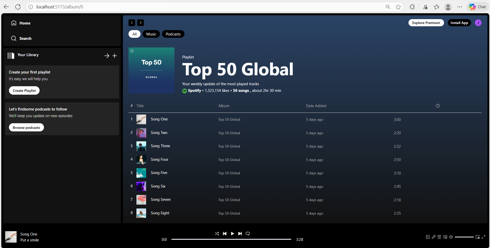

# Spotlify

Spotlify is a responsive music streaming web application inspired by modern music platforms. It is built using ReactJS and TailwindCSS, focusing on clean UI, smooth navigation, and an engaging user experience.

## Features

🎧 Browse albums and playlists with dynamic routing

📱 Fully responsive design for desktop, tablet, and mobile devices

⚡ Fast and smooth navigation using React Router

🎨 Modern and minimal UI built with TailwindCSS

🧩 Reusable React components for scalability and maintainability

## Tech Stack

Frontend: ReactJS

Styling: TailwindCSS

Routing: React Router

Build Tool: Vite / Create React App (based on your setup)

## Project Structure
spotlify/
│── src/
│   ├── assets/        # Images, icons, static data
│   ├── components/    # Reusable UI components (Navbar, Cards, etc.)
│   ├── pages/         # Album, Playlist, Home pages
│   ├── App.jsx        # Main application component
│   └── main.jsx       # Entry point
│
│── public/
│── package.json
│── tailwind.config.js
│── README.md

## Screenshots

### Home Page

### Album Page

## Installation & Setup

Clone the repository

git clone https://github.com/your-username/spotlify.git

Navigate to the project directory

cd spotlify

Install dependencies

npm install

Run the development server

npm run dev

The application will run on:

http://localhost:5173

